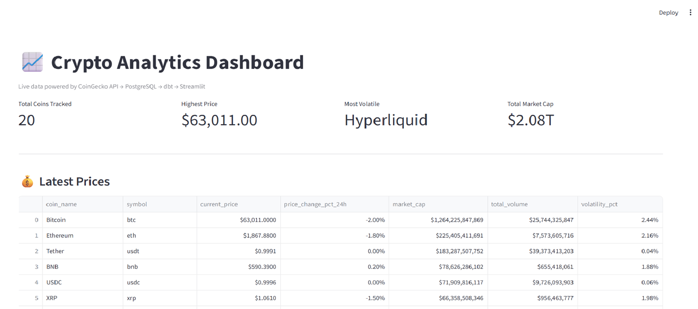
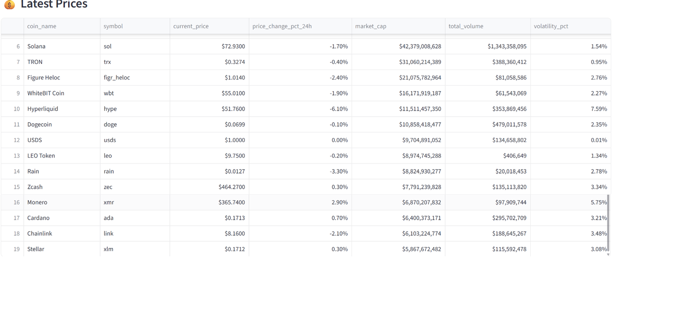
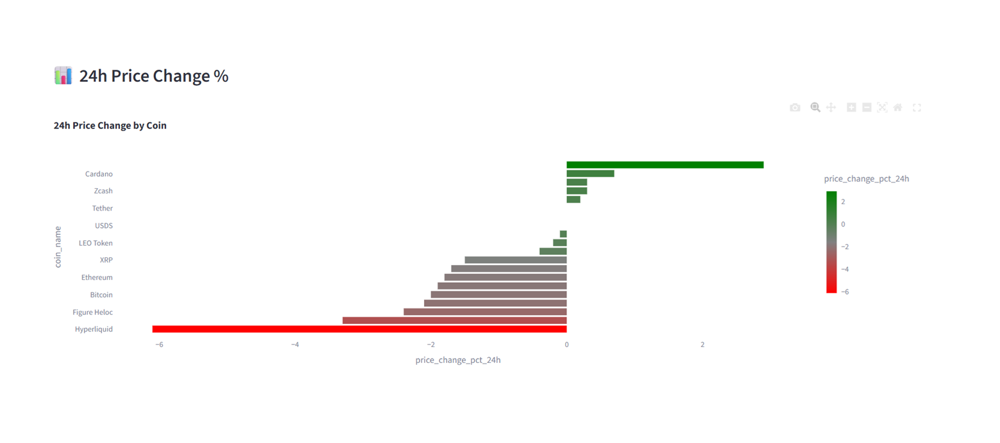
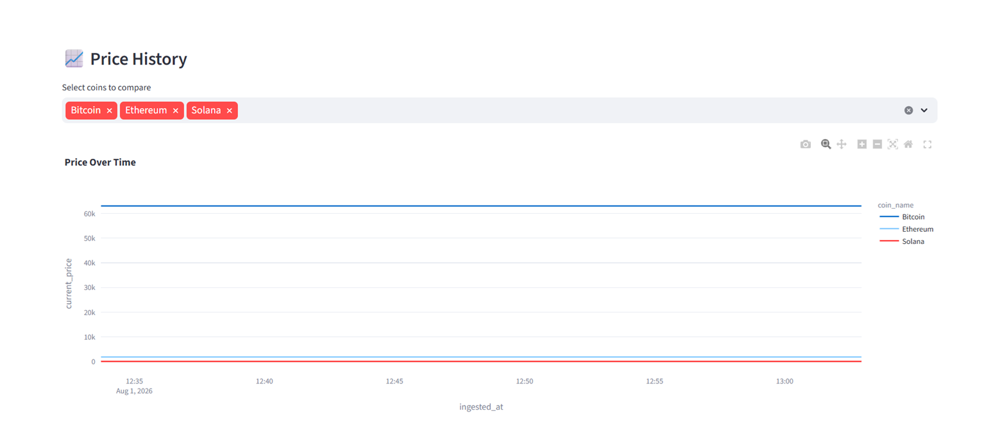
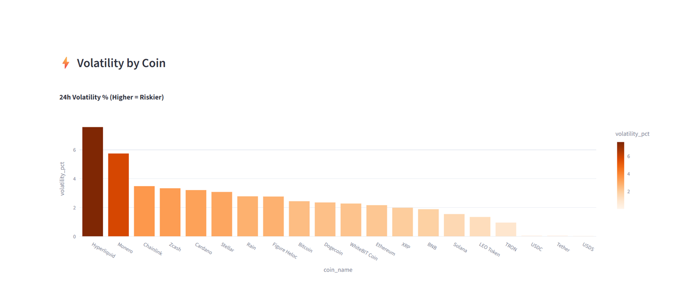

# Crypto Analytics Pipeline

A live end-to-end crypto analytics pipeline — real market data ingested every 5 minutes 
from CoinGecko API, stored in PostgreSQL, transformed with dbt, and visualized in a 
live Streamlit dashboard.

---

## Pipeline Architecture

CoinGecko API (live crypto prices)
↓
Python + APScheduler (ingestion every 5 minutes)
↓
PostgreSQL (raw_crypto_prices table)
↓
dbt (staging + mart models)
↓
Streamlit Dashboard (live visualization)

---

## Dashboard Features

- **KPI Cards** — total coins tracked, highest price, most volatile coin, total market cap
- **Latest Prices Table** — all 20 coins with price, 24h change, market cap, volume, volatility
- **24h Price Change Chart** — green/red bar chart showing winners and losers
- **Price History Chart** — multi-coin comparison over time, gets richer as pipeline runs
- **Volatility Chart** — ranks all coins by 24h volatility percentage

---

## dbt Transformation Layer

| Model | Type | Purpose |
|-------|------|---------|
| stg_crypto_prices | Staging | Cleans raw data, adds price_range_24h and volatility_pct |
| mart_latest_prices | Mart | Latest price snapshot per coin using ROW_NUMBER() window function |
| mart_price_history | Mart | Full historical snapshots for trend analysis |

---

## Tech Stack

- **Python** — data ingestion (requests, pandas, SQLAlchemy)
- **APScheduler** — automated pipeline execution every 5 minutes
- **PostgreSQL** — raw data warehouse
- **dbt** — transformation layer (staging + mart models)
- **Streamlit + Plotly** — live interactive dashboard

---

## How to Run

### 1. Install dependencies
```bash
pip install requests pandas sqlalchemy psycopg2-binary apscheduler streamlit plotly dbt-postgres
```

### 2. Set up PostgreSQL
Create a database called `crypto_analytics` in PostgreSQL.
Update the connection string in `ingest.py` and `dashboard.py` with your credentials.

### 3. Run dbt models
```bash
dbt run --project-dir crypto_analytics
```

### 4. Start the ingestion pipeline
```bash
python ingest.py
```

### 5. Launch the dashboard
```bash
python -m streamlit run dashboard.py
```

---

## Key Insights the Dashboard Surfaces

- **Hyperliquid** was the most volatile coin at 7.59% — highest risk in the top 20
- **Stablecoins** (USDT, USDC, USDS) show near-zero volatility — working as designed
- **Total crypto market cap** tracked live at $2.08T
- **Monero** second most volatile at 5.75% — privacy coins historically volatile

---

## Screenshots







